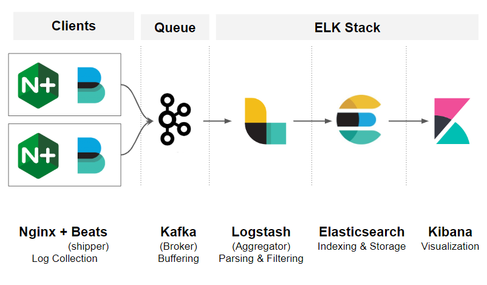

# kafka-elk
### Containers up
    docker-compose up

### del containers
    docker-compose down

### containers
    # list all containers
    docker ps -a

    # enter 
    docker exec -it xxxxxxxx bash

### elastic.co
https://www.docker.elastic.co/